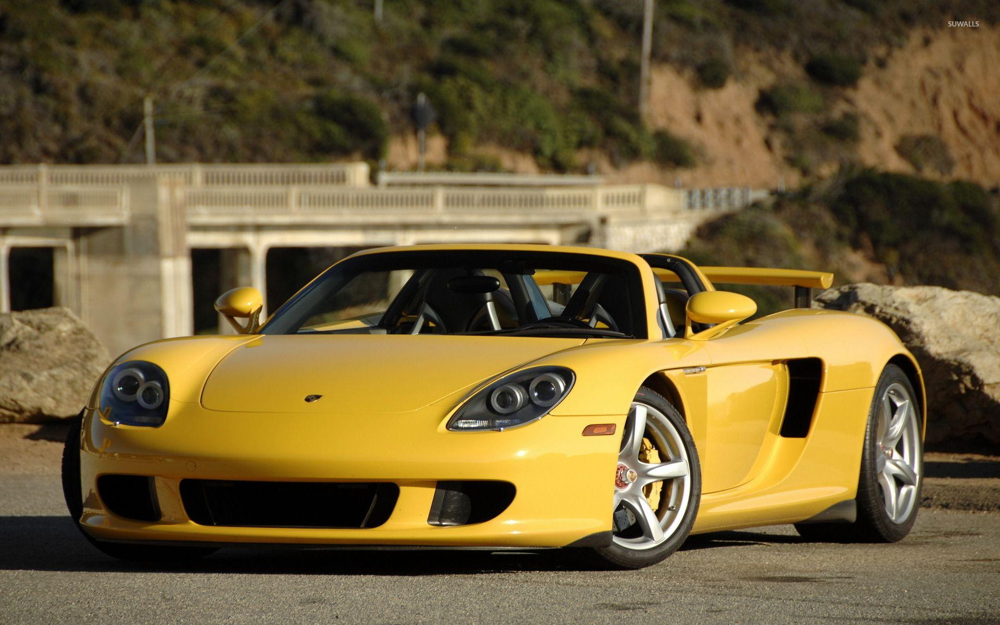

## TOP 5
### Ferrary enzo
<!-- foto -->
 

Tiene un motor V12 de gasolina central-trasero de 5999 cm³ (6 litros) que desarrolla una potencia máxima de 660 CV (651 HP; 485 kW) a las 7800 rpm, lo que le permite acelerar de 0 a 100 km/h (0 a 62 mph) en 3.14 segundos.

---
## TOP 4

### Porche carrera gt
<!-- foto -->

<!-- Enlaces -->
[Informacion sobre el porhce carrera](https://www.youtube.com/watch?v=tkiHZlFcOTA)

El Porsche Carrera GT es un automóvil superdeportivo producido por el fabricante alemán Porsche AG entre los años 2003 y 2006. Tiene motor central-trasero montado longitudinalmente y tracción trasera, con carrocería Targa de dos puertas y dos plazas.

--- 

## TOP 3
### Mazda 787B

El Mazda 787B es un automóvil de carreras del Grupo C del fabricante japonés Mazda. Es un prototipo Le Mans clásico que destaca por poseer un motor rotativo, fue un gran coche de competición durante su época de apogeo. Entre los aspectos a nivel competitivos que se le destacan, venció en las 24 Horas de Le Mans de 1991, se cree que el éxito que tuvo se debió a la innovación al incluir un motor rotativo.

---

## TOP 2
### Shelby cobra 
El AC Cobra es un automóvil deportivo anglo-estadounidense construido en los años de 1962 a 1966 por el fabricante AC Cars. En contra de la creencia popular, no fue este el primer automóvil en utilizar un chasis ligero y una carrocería de aluminio europeos.

---

## TOP 1
### Pagani zonda

Previamente a la presentación del Zonda, el argentino Horacio Pagani, su creador,5​ había trabajado como constructor en Lamborghini en proyectos como el Lamborghini Countach Evoluzione y como diseñador en el P140 y en el Lamborghini Diablo.

---

# <!--fit-->FIN